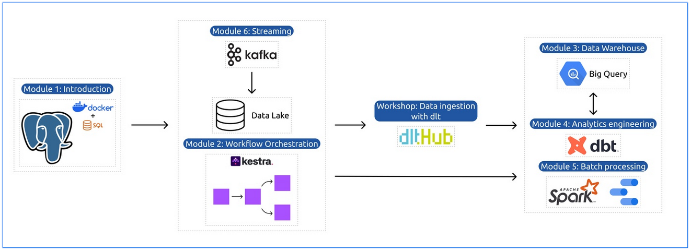

# DataTalks.Club – Data Engineering Zoomcamp 2025

Ce dépôt contient mes devoirs et exercices réalisés dans le cadre du **Data Engineering Zoomcamp 2025** proposé par [DataTalks.Club](https://datatalks.club/).

## 🎯 Objectifs

- Approfondir mes compétences en ingénierie des données
- Maîtriser les outils utilisés dans des environnements data modernes
- Travailler sur des projets concrets et reproductibles

## 👤 Auteur

**Moussa Mballo**  
GitHub : [@MoussaInc](https://github.com/MoussaInc)

---

> ⭐ N'hésitez pas à explorer, forker ou poser des questions !

## Modules

[**Module 1: Introduction & Prerequisites: docker-terraform**](01-docker-terraform/)

The answers are described in the following folder: 

* [Homework](chap01-docker-terraform/homework_01.md)

[**Module 2: Workflow Orchestration**](02-workflow-orchestration)

* [Homework](ch02-workflow-orchestration/homework_02.md)
* Office hours

[**Workshop 1: Data Ingestion**](workshops/dlt/README.md)

* Workshop with dlt
* [Homework](workshops/dlt/README.md)

[**Module 3: Data Warehouse**](03-data-warehouse)

* [Homework](chap03-data-warehouse/homework_03.md)

[**Module 4: Analytics Engineering**](04-analytics-engineering/)

* [Homework](chap04-analytics-engineering/homework_04.md)

[**Module 5: Batch processing**](05-batch/)

* [Homework](chap05-batch/homework_05.md)

[**Module 6: Stream Processing**](06-streaming)

* [Homework](chap06-streaming/homework_06.md)

[**Project**](project.md)

More information [here](project.md)

---

Un grand merci aux formateurs et contributeurs pour cette excellente formation gratuite :

- Alexey Grigorev 
- Victoria Perez Mola   
- Michael Shoemaker  
- Zach Wilson  
- Will Russell  
- Anna Geller  

Consultez le dépôt officiel ici : [DataTalksClub/data-engineering-zoomcamp](https://github.com/DataTalksClub/data-engineering-zoomcamp)

